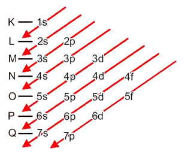

# Electronic Distribution

## About

Atom's electron distribution based on the Linus Pauling diagram.


## Running

If you have golang installed just run:
``` bash
$ go run .\src\main.go
```
otherwise you can install it [here](https://golang.org/dl/)
